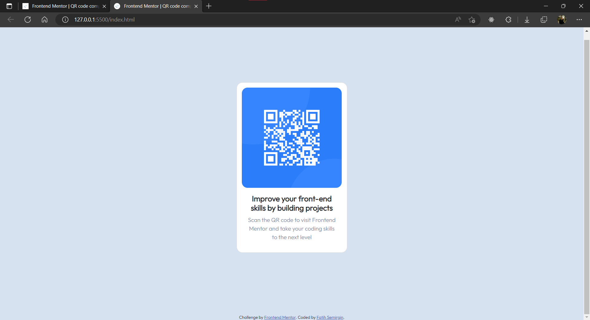

# Frontend Mentor - QR code component solution

This is a solution to the [QR code component challenge on Frontend Mentor](https://www.frontendmentor.io/challenges/qr-code-component-iux_sIO_H). Frontend Mentor challenges help you improve your coding skills by building realistic projects. 

### Screenshot



### Links

- Solution URL: [Add solution URL here](https://your-solution-url.com)
- Live Site URL: [QR Code Component](https://QR-Code-Component.fatihsemirgin.repl.co)

## My process

### Built with

- Semantic HTML5 markup
- CSS custom properties
- Flexbox
- CSS Grid
- [Bootstrap](https://getbootstrap.com/) - JS library

### What I learned

```css
.container {
  height: 100vh;
  display: flex;
  justify-content: center;
  align-items: center;
}
```

### Useful resources

- [Example resource 1](https://getbootstrap.com/) - This helped me for responsive design. I really liked this pattern and will use it going forward.


## Author

- Website - [Fatih Semirgin](https://www.your-site.com)
- Frontend Mentor - [@fatihsemirgin](https://www.frontendmentor.io/profile/fatihsemirgin)
